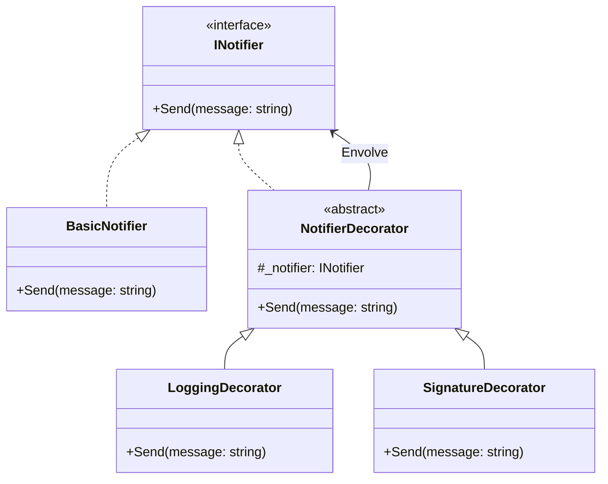

## Decorator

### Visão geral

O **Decorator** é um padrão de projeto estrutural que permite adicionar novas funcionalidades a um objeto sem modificar o código original dele. 
Assim, em vez de criar dezenas de classes diferentes para cada variação, você cria "embalagens" que adicionam esses comportamentos novos.

### Caso de uso

#### O Cenário
Você tem uma classe que envia notificações. De repente, pedem para adicionar um **Log** no terminal toda vez que enviar uma mensagem. Depois, pedem para adicionar uma **Assinatura** no final do texto.

#### O Problema da Herança

```csharp
public class Notifier { /* ... */ }

public class NotifierWithLog : Notifier { /* ... */ }
public class NotifierWithSignature : Notifier { /* ... */ }

// Como lidar com Log E Assinatura juntos sem criar uma nova classe específica?
// public class NotifierWithLogAndSignature : Notifier { ... }
```
O uso excessivo de herança para cada nova funcionalidade gera uma explosão de subclasses, tornando o projeto complexo e difícil de manter. Além disso, a herança é estática e rígida, impedindo a alteração do comportamento do objeto em tempo de execução.

### A Solução

Em vez de criar uma classe gigante que faz tudo, o Decorator cria pequenas classes que "envolvem" umas às outras. O objeto de fora faz a sua parte e passa o restante do trabalho para o objeto de dentro.

#### Estrutura Visual



* **A Interface (`INotifier`):** A regra que todos devem seguir.
* **O Básico (`BasicNotifier`):** A funcionalidade original pura.
* **O Decorador Base (`NotifierDecorator`):** A estrutura genérica que guarda o objeto envolvido.
* **Os Decoradores Específicos (`LoggingDecorator`, etc.):** As novas funcionalidades que envolvem a base.

### Implementação

#### 1. A Base

```csharp
public interface INotifier
{
    void Send(string message);
}

public class BasicNotifier : INotifier
{
    public void Send(string message) => Console.WriteLine($"Enviando: {message}");
}
```

#### 2. O Decorador Base

```csharp
public abstract class NotifierDecorator : INotifier
{
    protected readonly INotifier _notifier;
    
    public NotifierDecorator(INotifier notifier) => _notifier = notifier;

    public virtual void Send(string message) => _notifier.Send(message);
}
```

#### 3. Os Decoradores Específicos

```csharp
public class LoggingDecorator : NotifierDecorator
{
    public LoggingDecorator(INotifier notifier) : base(notifier) { }

    public override void Send(string message)
    {
        Console.WriteLine($"[LOG]: Registrando envio...");
        base.Send(message);
    }
}

public class SignatureDecorator : NotifierDecorator
{
    public SignatureDecorator(INotifier notifier) : base(notifier) { }

    public override void Send(string message)
    {
        string signedMessage = $"{message}\n-- Equipe de TI"; 
        base.Send(signedMessage);
    }
}
```

### Uso 

Os comportamentos são empilhados como peças. O código roda de fora para dentro:

```csharp
INotifier notificacao = new BasicNotifier();
notificacao = new SignatureDecorator(notificacao);
notificacao = new LoggingDecorator(notificacao);

notificacao.Send("Sistema atualizado!");

/* Saída no console:
[LOG]: Registrando envio...
Enviando: Sistema atualizado!
-- Equipe de TI
*/
```

### Benefícios

* **Subclasses pequenas:** Combina pequenos blocos em vez de criar classes enormes.
* **Flexibilidade total:** Pode adicionar ou tirar funcionalidades a qualquer momento em tempo de execução.
* **Organização limpa:** Cada classe faz apenas uma coisa, respeitando a Responsabilidade Única.

### Pontos de atenção

* **A ordem importa:** A sequência em que os decoradores são empilhados altera o resultado final da execução.
* **Muitos objetos pequenos:** O código de criação (instanciação) pode ficar longo se houver muitas camadas.

### Conclusão

O **Decorator** é a melhor escolha quando você precisa adicionar pequenos "extras" a um objeto que já funciona, sem ter que alterar o código dele ou criar uma montanha de subclasses combinadas. 
